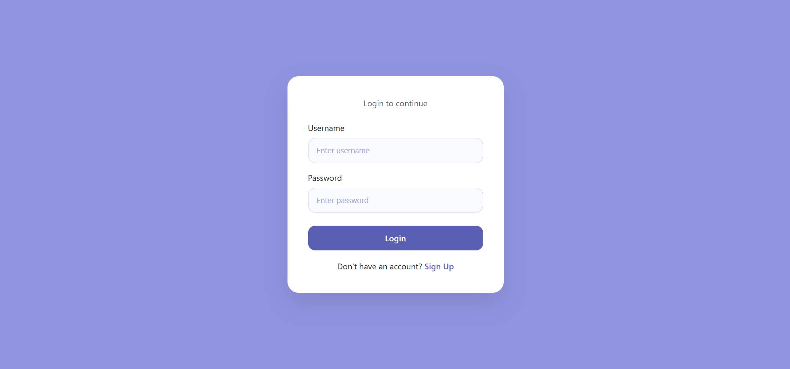
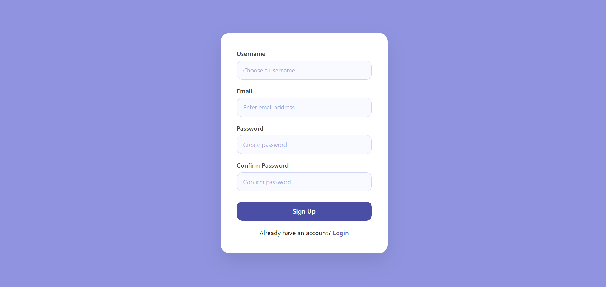
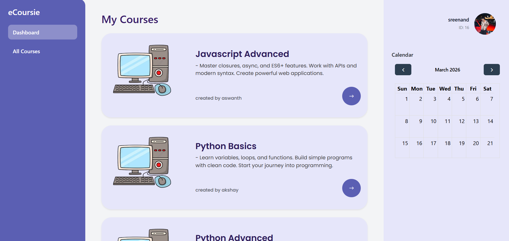
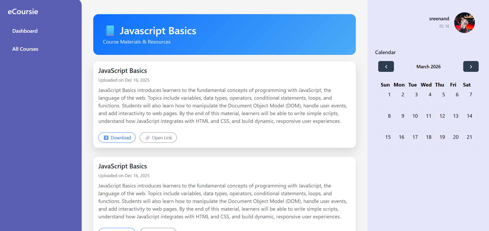
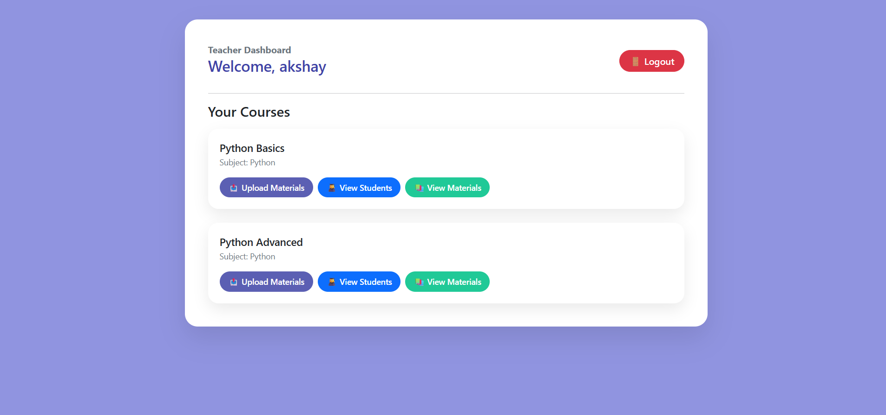
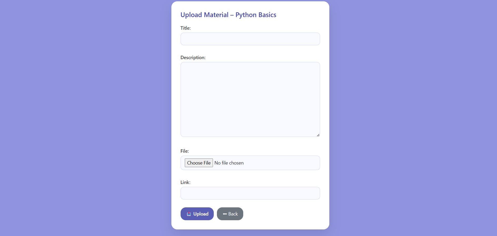
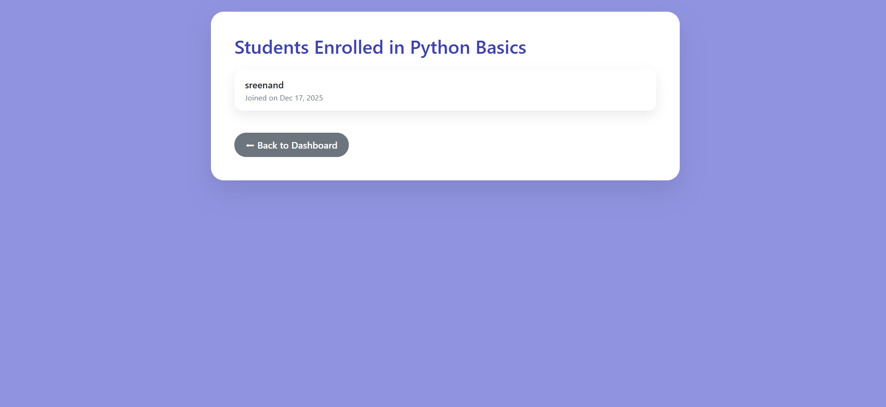

# Academic Management System

A modular academic management platform built with Django and PostgreSQL.

## Overview

This project demonstrates structured backend architecture using a multi-app Django setup. It manages students, teachers, courses, subjects, enrollments, materials, and parent relationships.

## Core Modules

- Accounts (Custom User Model)
- Students Management
- Teachers Management
- Subjects & Courses
- Enrollment System
- Academic Materials Handling
- Parent Associations

## Technical Highlights

- Custom User Model
- PostgreSQL Database Integration
- Modular Django App Architecture
- ForeignKey & ManyToMany Relationships
- Role-Based Access Logic
- Server-Side Rendering (Django Templates)
- Media Handling Configuration

## Tech Stack

- Python
- Django
- PostgreSQL
- Django ORM
- HTML Templates

## Setup Instructions

1. Clone the repository
2. Create virtual environment
3. Install dependencies
4. Configure `.env`
5. Run migrations
6. Start development server

## Note

Media files and environment variables are excluded from version control.

## 📸 Application Preview

### 🔐 Authentication
| Login | Signup |
|-------|--------|
|  |  |

---

### 🎓 Student Dashboard

---

### 📂 Materials Access

---

### 👨‍🏫 Teacher Dashboard

---

### ⬆️ Teacher Upload System

---

### 📋 Enrolled Students

